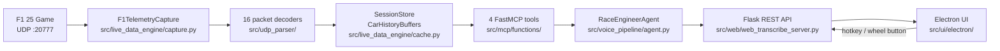

# f1_radaio

**Virtual F1 Race Engineer** — pairs Codemasters F1 25 UDP telemetry with an AI voice assistant
that responds to your questions in real time, exactly like a real race engineer.

[](https://github.com/trikialaa/f1_radaio/actions/workflows/tests.yml)
[](https://codecov.io/gh/trikialaa/f1_radaio)
[](https://www.python.org)
[](LICENSE)

> **Unofficial project.** Not affiliated with Formula 1, EA, or Codemasters. See [DISCLAIMER.md](DISCLAIMER.md).

---

## Demo

<!-- TODO: replace with a screen recording or GIF of the Electron overlay in action -->
*A demo GIF showing the overlay and a sample engineer conversation will go here.*

Sample exchange:
> **You:** "Bono, what's my tyre deg looking like?"
> **Bono:** "Front-left at thirty-two percent wear, rear-left twenty-eight. You're good for another eight laps on the mediums."

---

## Architecture



**Data flow:** The game broadcasts UDP packets at ~60 Hz. Each packet is decoded by a typed
parser, merged into in-memory ringbuffers, and exposed through four FastMCP tools. On every
voice interaction the agent automatically injects the current `get_context_frame` snapshot
(position, tyres, weather, gap) so the LLM always has live race state without the user having
to ask for it explicitly.

---

## MCP Tools

| Tool | Description |
|---|---|
| `get_context_frame` | Rich snapshot of current session state — injected automatically before every agent turn |
| `get_leaderboard` | Full 20-car grid with gaps, tyre compounds, and lap-count deltas |
| `get_weather_forecast` | Current conditions + 3-horizon forecast |
| `get_strategy` | Current tyre, pit window, and available tyre sets with usage |
| `get_lap_times` | Per-car lap and sector times with best/recent split |
| `get_recent_events` | Race events (safety car, penalties, fastest lap) with severity |

---

## Quickstart

### Prerequisites
- Python 3.11+
- Node.js 18+ (for the Electron UI)
- F1 25 — Settings → Telemetry → UDP Output: On, Port: 20777

### Install

```bash
# Clone
git clone https://github.com/trikialaa/f1_radaio.git && cd f1_radaio

# Python dependencies
pip install -r requirements.txt -r requirements-dev.txt

# Node / Electron
npm ci

# Configure API keys
cp .env.example .env
# Edit .env — fill in DEEPGRAM_API_KEY, BASETEN_*, INWORLD_*
```

### Run

```bash
# Full stack (Flask + Electron window)
python main.py

# Headless — Flask API only, no Electron, no game required
make run-headless

# With a packet replay instead of a live game:
python helpers/udp_sampler/replay.py --loop &
make run-headless
```

Press and hold the configured hotkey (or a steering wheel button) and speak. Release to submit.

---

## Development

```bash
make lint       # ruff check + format check
make typecheck  # mypy (src/mcp/functions, src/udp_parser)
make test       # pytest with coverage
```

Install git hooks (runs ruff on every commit):

```bash
pre-commit install
```

See [CONTRIBUTING.md](CONTRIBUTING.md) and [tests/README.md](tests/README.md) for full details.

---

## Design decisions

**Why MCP as the tool boundary?**
The [Model Context Protocol](https://modelcontextprotocol.io) gives the LLM a clean, typed
interface to query telemetry on demand. It separates the agent logic from the data layer
entirely — new tools can be added or the LLM can be swapped without touching the parsers or
the Flask server.

**Why in-memory ringbuffers (no database)?**
F1 telemetry is ephemeral by nature — a lap time from three laps ago has no tactical relevance.
Ringbuffers let the system stay at ~0 MB/s write amplification while the tool layer always
sees the freshest data. No schema, no migrations, no persistence overhead.

**Why is `get_context_frame` auto-injected?**
Requiring the agent to ask for telemetry before every answer adds a full LLM round-trip of
latency. Injecting the context frame unconditionally keeps responses under 1 s while ensuring
the model never answers from stale in-weights knowledge about the race.

**Why a parity-gated fixture for tests?**
The test suite feeds a 3.14 MB downsampled slice of a real Catalunya race to the production
decode path in-process (no socket, no API keys, ~5 s). Before the slice was committed it was
validated against the full 70 MB source by calling all four pure-read tools at every race
marker and asserting masked-equal output. This makes the small fixture a *behaviorally faithful*
proxy rather than a lossy approximation. See [tests/README.md](tests/README.md).

---

## Project layout

```
src/
  udp_parser/           # Binary packet decoders + constants (aligned with F1 25 spec)
  live_data_engine/     # UDP listener thread, SessionStore, CarHistoryBuffers
  mcp/                  # FastMCP wiring: functions/, tools.py, server.py
  voice_pipeline/       # RaceEngineerAgent, STT (Deepgram), TTS (Inworld), callouts
  web/                  # Flask REST API (/transcribe, /tts, /callout-stream)
  ui/
    electron/           # Electron shell + global hotkey / steering wheel capture
    web_static/         # Vanilla JS frontend (Web Audio API, latency display)
helpers/
  udp_sampler/          # record.py, replay.py, shipped capture file
  wheel_detector/       # C#/.NET 8 WheelHelper.exe for steering wheel buttons
tests/
  fixtures/             # 3.14 MB race fixture, markers.json, golden JSONs
  unit/                 # Pure function tests (helpers, config, callouts, parsers)
  deterministic/        # Golden-snapshot + invariant tests for all 6 MCP tools
  integration/          # MCP registration, Flask endpoint, SSE stream tests
docs/
  f1_telemetry_docs.md  # F1 25 UDP specification (reference; see DISCLAIMER.md)
```

---

## Legal

This project is unofficial and not affiliated with Formula 1, the FIA, EA Sports, or
Codemasters. "F1", "Formula 1", team names, and driver names are trademarks of their respective
owners. For personal, educational, non-commercial use only. See [DISCLAIMER.md](DISCLAIMER.md).
